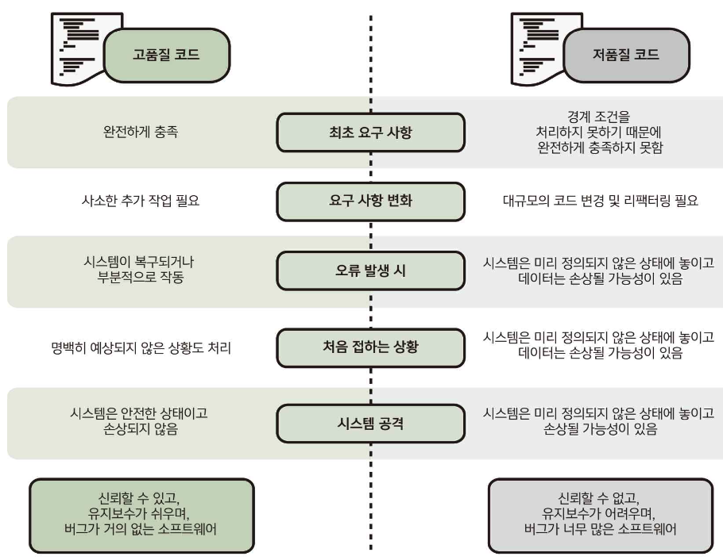
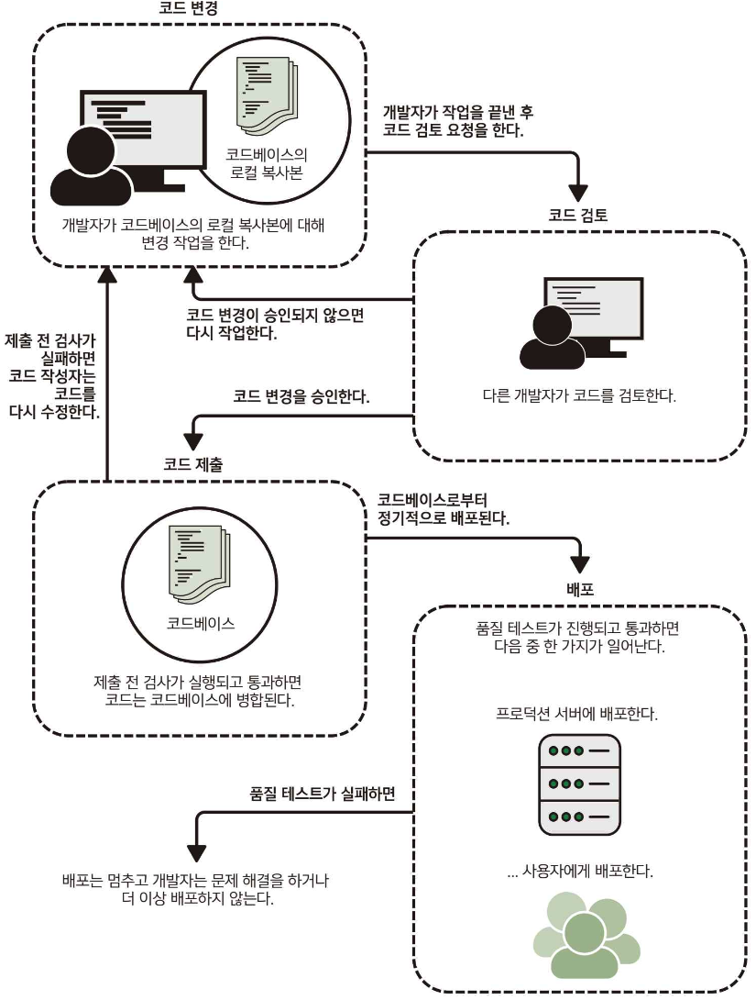
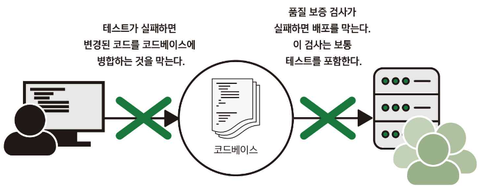

> 이 장의 내용
> 
> - 코드 품질이 중요한 이유
> - 고품질의 코드가 이루고자 하는 네 가지 목표
> - 고품질 코드 작성을 위한 높은 수준에서의 여섯 가지 전략
> - 고품질의 코드 작성이 어떻게 중장기적으로 시간과 노력을 절약할 수 있는지

# 고품질 코드

- 일반적으로 좀 더 신뢰할 수 있음
- 유지보수가 쉬움
- 버그가 적은 소프트웨어를 생산함

## 코드 품질을 높이는 것에 대한 많은 원칙들

- SW가 처음에 만들어지는 방식을 보장해줌
- 요구사항이 진화하고 새로운 상황이 등장하더라도 그 방식을 계속 유지할 수 있도록 하는 것에 관심을 둠

## vs 저품질 코드

> 좋은 코드가 좋은 SW를 만들기 위한 유일한 조건은 당연히 아니지만, 중요한 조건 가운데 하나
> 

> 좋은 SW인지 않은지는 엔지니어들이 코드를 작성할 때 내리는 일상적인 결정들이 모여서 이뤄짐
> 

# 1.1 코드는 어떻게 SW가 되는가

> SW는 코드로 만들어진다
> 
- 코드는 일반적으로 엔지니어가 작성하자마자 SW가 되는 것이 아님
    - 코드가 의도한 대로 작동하고 기존의 기능이 여전히 잘 작동한다고 확신하기 위한 다양한 점검이 이뤄짐
        - 이러한 과정을 SW 개발 및 배포 프로세스라고 부름

## SW 개발 및 배포 프로세스

### 1. 코드베이스(codebasae)

- SW를 빌드할 수 있는 코드가 저장된 저장소
- 일반적으로 git, subversion, perforce 등과 같은 형상 관리 시스템에 의해 관리 됨

### 2. 코드 제출(submitting code)

- 가끔 코드 커밋 혹은 PR 머징이라고도 불림
- 개발자는 일반적으로 코드베이스를 자신의 로컬 컴퓨터에 복사하고 여기서 코드를 변경
- 코드 변경이 끝나면 변경된 사항을 메인 코드베이스에 제출
- 변경 사항을 작성자가 제출하지 않고 지정된 관리자가 코드베이스로 가져오도록 하는 설정도 있음

### 3. 코드 검토(code review)

- 코드를 코드베이스에 제출하지 전에 다른 엔지니어가 변경된 내용을 컴토
- 코드 작성자가 놓친 문제를 발경

### 4. 제출 전 검사(per-submit check)

- pre-merge hook, pre-merge check, pre-commit check이라고도 함
- 테스트가 실패하거나 코드가 컴파일되지 않은 경우 변경 사항이 코드베이스에 병합되지 않도록 차단

### 5. 배포(release)

- SW는 코드베이스의 스냅샷을 기반으로 빌드됨
- 다양한 품질 보증 검사 후에 실제 실행 환경에 배포됨
- 코드베이스의 특정 버전을 가져와서 배포하는 프로세스를 일컬어 배포 브랜치 만들기(cutting release)라는 문구를 자주 사용함

### 6. 프로덕션(production)

- SW가 서버나 시스템에 배포될 때, 테스트 환경과 같이 내부적으로 사용하는 것이 아닌 실제 서비스되는 환경을 가리킴
- SW가 출시되고 비즈니스 관련 작업을 수행하면 프로덕션 환경에서 실행된다고 말함

## 정리

1. 개발자가 코드베이스의 로컬 복사본을 가지고 작업하면서 코드를 변경
2. 작업이 끝나면 코드 검토를 위해 변경된 코드를 가지고 병합 요청
3. 다른 개발자가 코드를 검토하고 변경을 제안
4. 작성자와 검토자가 모두 동의하면 코드가 코드베이스에 병합됨
5. 배포는 코드베이스를 가지고 주기적으로 일어남
    - 얼마나 자주 배포되는지는 조직과 팀마다 다름
6. 테스트에 실패하거나 코드가 컴파일되지 않으면 코드베이스에 병합되는 것을 막거나 코드가 배포되는 것을 막음

# 1.2 코드 품질의 목표

> 고품질의 SW를 만들기 위해서는 SW가 잘 구축되어야 한다
> 

### 코드 품질

- 사소하고 별로 중요하지 않은 사항에 대한 세세한 충고로 보일 수 있지만, 실제적인 관심 사항에 근거를 둠
- 때에 따라 사소하거나 중요한 세부 사항에 관심을 가질 수 있지만, 더 나은 SW를 만드는 것이라는 목표는 동일함

> 코드를 고품질 혹은 저품질로 정의하는 것은 본질적으로 주관적으로 다소 성급한 것
> 

### 필자가 생각하는 높은 코드의 기준

1. 작동해야 함
2. 작동이 멈춰서는 안 됨
3. 변화하는 요구 사항에 적응해야 함
4. 이미 존재하는 기능을 또다시 구현해서는 안 됨

## 1.2.1 코드는 작동해야 한다

- 너무 당연 함
- 코드를 작성하는 이유: 문제를 해결하기 위함
    - 코드가 제대로 작동하지 않으면, 문제를 완전히 해결하지 못할 가능성이 있음
- 코드의 첫 번째 목표: 코드가 작성된 목적대로 동작해야 함

## 1.2.2 코드는 작동이 멈추면 안 된다

- 코드 작동은 일시적일 수 있음
- 주변 상황이 변하면, 코드가 동작이 멈출 수 있음
    - 의존한 코드의 수정으로 인한 작동 중지
    - 요구사항 추가로 인한 기능 추가
    - 시대의 흐름에 따른 기능 변경
- 위의 3가지 중 하나가 변경되었을 때 제대로 동작하지 않으면 그 코드는 유용한 코드가 아님
- 변화하는 환경과 요구 사항에도 불구하고 계속 작동하는 코드를 만드는 것은 훨씬 어려움
- 코드가 계속 작동하도록 보장하는 것: SW 엔지니어가 직면하는 큰 과제 중 하나 + 코딩의 모든 단계에서 고려해야 할 사항

## 1.2.3 코드는 변경된 요구 사항에 적응할 수 있어야 한다

- SW를 오랜기간 동안 지속적으로 개발하는 과정에서 다음과 같은 이유로 요구 사항은 계속 변함
    - 비즈니스 환경의 변화
    - 사용자 선호의 변화
    - 가정이 더 이상 유효하지 않음
    - 새로운 기능이 계속 추가됨
- 적응 가능한 코드를 작성하기 위해 얼마나 많은 노력을 기울여야 할지에 대해 균형 잡힌 결정을 내리는 것은 까다로움
    - SW의 요구 사항은 시간이 지나면 변화한다는 것은 알지만, 어떻게 변할지는 정확히 알 수 없음
    - 어떻게 변할지 정확히 알지 못한다고 변한다는 사실을 무시해야 하는 것은 아님
    - 프로젝트와 조직 문화에 따라 적당한 비율로 맞춰나가야 함

## 1.2.4 코드는 이미 존재하는 기능을 중복 구현해서는 안 된다

- 문제를 해결하기 위해 코드를 작성할 때, 일반적으로 큰 문제를 여러 개의 작은 하위 문제로 나눔

### 이미 구현된 코드를 재사용하면 좋은 이유

1. 시간과 노력을 절약함
    - 파일을 로드하기 위해 프로그래밍 언어에서 지원하는 기능을 사용한다면, 몇 줄의 코드와 몇 분의 시간이면 충분함
    - 이 기능을 자신의 코드로 다시 작성한다면, 시간이 오래 걸림
2. 버그 가능성을 줄여줌
    - 주어진 문제를 해결할 수 있는 기존 코드는 이미 철저히 테스트했을 것임
    - 실제 서비스 환경에서 이미 사용되고 있을 것이기 때문에 버그 가능성은 작아짐
        - 버그가 있었다면 이미 발견되고 해결되었을 가능성이 큼
3. 기존 전문지식을 활용
    - 코드를 관리하는 팀은 해당 기능에 대한 지식이 많은 전문가일 가능성이 큼
    - 코드를 재사용함으로써 우리는 그들의 전문지식과 향후 있을 업데이트를 받을 수 있음
4. 코드가 이해하기 쉬움
    - 표준화된 방식으로 작성된 코드를 보면 그것이 어떻게 작동하는지 즉시 이해할 것임
    - 자신만의 코드를 작성한다면, 그러지 못할 것

---

- 어떤 하위 수준의 문제를 해결하기 위해 다른 개발자가 이미 코드를 작성했다면, 그것을 해결하기 위해 자신의 코드가 아닌 이미 구현된 코드를 사용해야 함
- 어떤 하위 수준의 문제를 해결하기 위해 자신이 이미 코드를 작성했다면, 다른 개발자들이 동일한 문제를 해결하기 위해 자신만의 코드를 다시 작성하지 않도록 쉽게 재사용할 수 있는 방식으로 코드를 구성해야 함
- 같은 종류의 하위 문제가 종종 반복해서 발생하기 때문에 코드를 공유하면 이점이 많음

# 1.3 코드 품질의 핵심 요소

## 코드 품질의 여섯 가지 핵심 요소

1. 코드는 읽기 쉬어야 한다.
2. 코드는 예측 가능해야 한다.
3. 코드를 오용하기 어렵게 만들라.
4. 코드를 모듈화하라.
5. 코드를 재사용 가능하고 일반화할 수 있게 작성하라.
6. 테스트가 용이한 코드를 작성하고, 제대로 테스트하라

## 1.3.1 코드는 읽기 쉬어야 한다

### 텍스트를 읽기 어렵게 만드는 문제

- 제목이 없으면, 전체 구절을 읽어야 한다.
- 여러 단계로 설명하지 않고 있다.
    - 하나의 큰 텍스트로 제시된다.
- 모호한 이름으로 언급된다.
- 어떤 정보는 필요할 때 제공되지 않고 있다.

### 코드를 읽을 때, 이해하기 위해 애쓰는 것

- 코드가 하는 일
- 어떻게 그 일을 수행하는지
- 어떤 것을 필요로 하는지
- 코드 실행 결과물

---

- 코드를 작성하고 난 후 어느 시점이 되면 다른 개발자가 그 코드를 읽고 이해해야 하는 상황이 반드시 옴
    - 코드가 병합되기 전에 코드 검토를 받아야 한다면, 그 일은 코드 작성 후 바로 일어난 것
    - 요구 사항이 변경되거나 디버깅이 필요할 때도 올 수 있음
    

> 코드의 가독성이 떨어진다면, 다른 개발자가 그 코드를 이해하는데 많은 시간을 들여야 한다.
> 
- 코드의 기능에 대해 잘못 이해하거나 몇 가지 중요한 세부 사항을 놓칠 수 있음
    - 코드 검토 중에 버그를 발견할 가능성이 적고, 새로운 기능을 추가하기 위해 다른 사람이 코드를 수정할 때 새로운 버그가 도입될 가능성이 큼

> 코드가 무엇을 하는지 개발자가 이해하지 못하면, SW 전체가 제대로 작동하는 것은 거의 불가능에 가까움
> 

## 1.3.2 코드는 예측 가능해야 한다

- 개발자는 이름, 데이터 유형, 일반적인 관행과 같은 단서를 사용해 코드가 입력값으로 무엇을 예상하는지, 코드가 무슨일을 하는지, 무엇을 반환하는지에 대한 정신 모델을 구축함
- 이 정신 모델과 어긋나는 어떤 일이 코드에서 일어나면, 이로 인해 버그가 아무도 모르게 코드 내로 유입되는 일이 너무도 많이 일어남
- 코드의 사용자는 그 코드에 의해 일어날 일을 예상하지 않고 있기 때문에, 정신 모델과 어긋나는 일이 실제로 일어난 줄 알지 못한 채 작업을 진행함
    - 나중에 프로그램이 잘못된 상태에 놓이거나, 이상한 값이 사용자에게 반환되는 심각한 상황을 초래할 수 있음
- 아무리 좋은 의도를 가진 코드라도, 예상을 벗어난 동작을 수행하는 위험이 있을 수 있음

> 코드가 예상에서 벗어나는 일을 한다면, 그 코드를 사용하는 개발자는 그 상황을 알지 못하거나 그 상황에 대처할 생각을 하지 못할 것
> 
- 문제의 코드와는 전혀 상관없어 보이는 부분에서 명백하게 이상한 일이 발견되기 전까지 시스템은 계속 비정상적으로 작동함
- 이런 코드는 사소한 오류부터 재앙과도 같은 상황을 초래할 수도 있음
- 코드가 예상을 벗어나는 일을 수행하지는 않는지 주의 깊게 살펴야 하고, 할 수 있다면 그런 코드를 작성하지 않도록 노력해야 함

## 1.3.3 코드를 오용하기 어렵게 만들라

- 코드를 호출할 때, 코드는 인수가 입력되거나 시스템이 특정 상태에 있을 것을 예상함
- 예상 밖의 상태로 코드를 호출하면, 시스템은 작동을 멈추고, DB가 영구적으로 손상되거나, 중요한 데이터가 손실될 수 있음
    - 코드가 작동하지 않을 가능성이 큼

> 자신이 작성한 코드가 호출된 데는 이유가 있는데, 그 코드가 잘못 사용된다면 중요한 일이 수행되지 않거나, 이상하게 동작하지만 눈에 띄지 않는다는 것을 의미할 수 있다.
> 
- 코드룰 오용하기 어렵거나 불가능하게 하면 코드가 작동할 뿐만 아니라 계속해서 잘 작동할 가능성을 극대화 할 수 있음

## 1.3.4 코드를 모듈화하라

- 모듈화: 개체나 시스템의 구성 요소가 독립적으로 교환되거나 교체되도록 만든 것
- 모듈화된 시스템의 주요 특징 중 하나: 인터페이스가 잘 정의되어 서로 다른 구성 요소 간 상호작용하는 지점이 최소화됨
- 코드를 외부에 의존하지 않고 실행할 수 있는 모듈로 나누는 것이 이로울 때가 많음
    - 변화하는 요구 사항에 더 쉽게 적응할 수 있는 코드를 작성하는 데 도움이 됨
        - 한 가지 기능을 변경한다고 해서 다른 부분까지 변경할 필요가 없기 때문
    - 모듈화된 시스템은 일반적으로 이해하기 쉽고 추론하기 쉬움
        - 기능이 관리 가능한 단위로 나눠지고 기능 단위 간 상호작용이 잘 정의되고 문서화되기 때문
- 코드가 모듈화되어 작성되면 코드가 하는 일을 개발자들이 오해할 소지가 적어 지속적으로 작동될 가능성이 큼

## 1.3.5 코드를 재사용 가능하고 일반화할 수 있게 작성하라

- 재사용성(reusability): 어떤 문제를 해결하기 위한 무언가가 여러 가지 다른 상황에서도 사용될 수 있음
- 일반화성(generalizability): 개념적으로는 유사하지만 서로 미묘하게 다른 문제들을 해결할 수 있음
- 코드베이스에서 코드 라인이 적을수록 좋음
    - 적은 코드 라인으로 같은 문제를 해결하는 것은 대단한 것
    - 버그가 발생할 확률이 적고, 노력을 덜 기울일 수 있음

> 코드가 재사용할 수 있고 일반화되어 있으면 우리는 그 코드를 코드베이스의 여러 부분에서, 하나 이상의 상황에서 사용할 수 있고, 여러 가지 문제를 해결할 수 있다.
> 
- 위의 코드는 시간과 노력을 절약해주고 더 신뢰할 수 있음
    - 실제 서비스 환경에서 이미 시도괴고 테스트된 논리를 재사용하기 때문
        - 어떤 버그라 할지라도 이미 발견되고 해결되었을 가능성이 큼
- 모듈화된 코드 역시 더 높은 재사용성과 일반화성을 가짐

## 1.3.6 테스트가 용이한 코드를 작성하고 제대로 테스트하라

> 버그와 제대로 동작하지 않는 기능을 가지고 있는 코드가 실제 서비스 환경에서 실행되지 않도록 하는 프로세스에서 테스트는 중요한 부분을 차지한다.
> 

### 테스트의 두 가지 핵심 방어 사항

- 버그나 제대로 동작하지 않는 기능을 갖는 코드가 코드베이스에 병합되지 않도록 방지
- 버그나 제대로 동작하지 않는 기능을 갖는 코드가 배포되지 않도록 막고 서비스 환경에서 실행되지 않도록 보장

> 테스트는 코드가 동작하고, 멈추지 않고 계속 잘 실행되도록 보장하기 위해 필수적인 부분이다.
> 

### 테스트가 중요한 2가지 이유

- SW 시스템과 코드베이스는 너무 크고 복잡해 한 사람이 모든 세부 사항을 알 수 없음
- 사람은 실수를 함

---

### 테스트와 테스트 용이성의 차이

- 테스트(test)
    - 코드 혹은 SW 전체를 테스트하는 것과 관련 있음
    - 수동이나 자동으로 수행됨
    - 개발자는 테스트 코드를 통해 실제 코드를 돌려보고, 모든 것이 정상적으로 작동하는지 확인하고 이것을 자동화하기 위해 노력함
    - 여러가지 수준의 테스트
        - 단위 테스트(unit test): 일반적으로 개별 함수나 클래스와 같은 작은 단위의 코드를 테스트
            - 가장 자주 작업하는 수준의 테스트
        - 통합 테스트(integration test): 시스템 구성 요소들이 제대로 작동하고 멈추지 않고 계속 실행하는지 알 수 있음
            - 통합(integration): 구성 요소와 하위 시스템을 함께 연결하는 과정
        - 종단간 데스트(end-to-end test): 처음부터 끝까지 전체 SW 시스템에서 작동의 흐름을 테스트
- 태스트 용이성(testability): 테스트 대상이 되는 실제 코드를 가리키며 해당 코드가 얼마나 테스트하기 적합한지를 나타냄
    - 서브 시스템 수준에서도 적용될 수 있음
    - 모둘화와 깊은 관련이 있으며, 모듈화된 코드는 테스트 용이성이 더 좋음
    - 테스트 용이성이 낮으면 제대로 테스트하는 것이 불가능할 수 있음
- TDD(Test-Driven Development): 테스트 코드부터 작성해야하는 개발 방법론

# 1.4 고품질 코드 작성은 일정을 지연시키는가?

> 고품질 코드를 작성하는데 시간이 더 걸릴 수 있다.
> 
- 높은 품질의 코드를 작성하는 것은 보통 우리 머릿속에 떠오르는 것을 바로 코딩하는 것보다 조금 더 많은 생각과 노력이 필요함
    - 하지만 일회성 프로그램이 아닌 좀 더 중요한 SW를 개발하고 있다면, 중장기적으로는 개발 시간을 단축해줌

> 코드 품질을 고려하지 않고 먼저 떠오르는 대로 코딩하면 처음에는 시간을 절약할 수 있지만, 머지않아 취약하고 복잡한 코드베이스로 귀결될 것이며, 점점더 이해하기 어렵고 추론할 수 없는 코드가 된다.
> 
- 새로운 기능을 추가하거나 버그를 수정하는 것이 점점 더 어려워지고 시간도 더 많이 걸림

# 요약

- 좋은 SW를 만들려면 고품질 코드를 작성해야 함
- 실제 서비스 환경에서 실행되는 SW가 되기 전에 코드는 일반적으로 여러 단계의 검사와 테스트를 통과해야 함
- 버그나 제대로 동작하지 않는 기능이 사용자에게 제공되고나 비즈니스에 중요한 시스템에서 실행되는 것을 이러한 검사를 통해 막을 수 있음
- 테스트는 코드를 작성하는 모든 단계에서 고려하는 것이 좋다.
    - 코드를 다 작성하고 난 후에 고려하는 것이 아님
- 고품질 코드를 작성하면 처음에는 시간이 오래 걸리지만, 중장기적으로는 개발 시간이 단축되는 경우가 많음