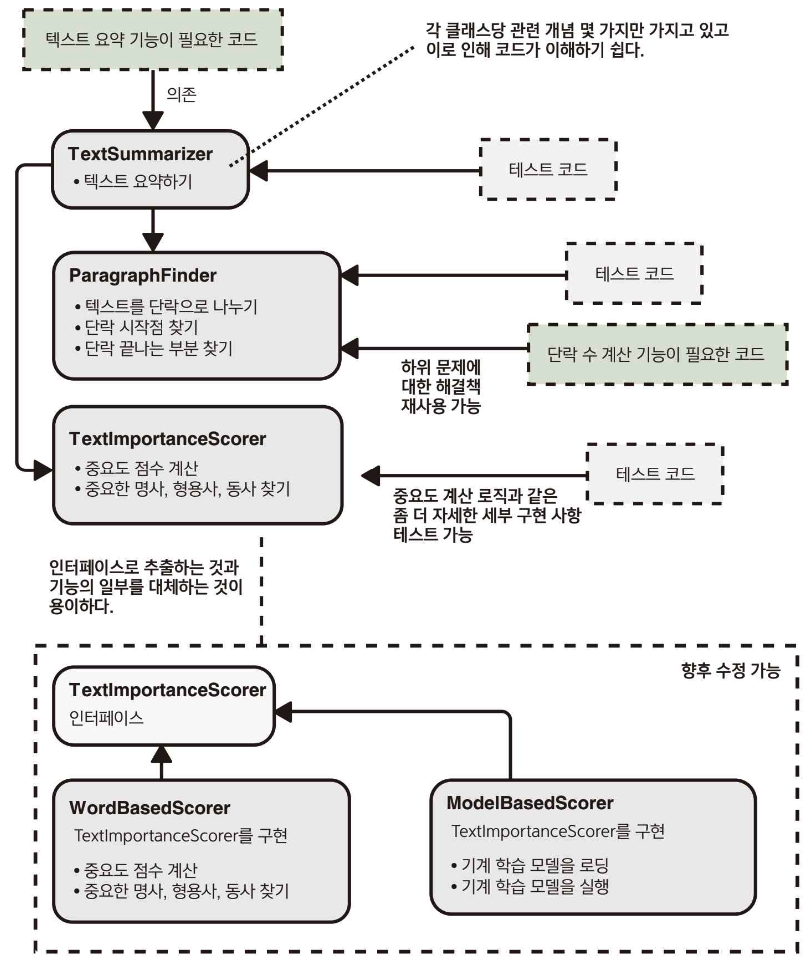
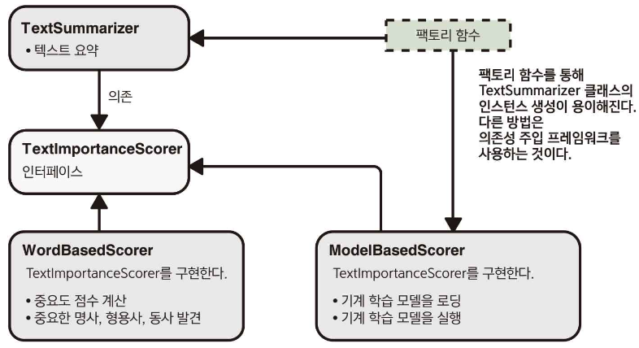

> 이 장의 내용
> 
> - 깔끔한 추상화 계층을 통해 문제의 하위 문제로 세분화하는 방법
> - 추상화 계층의 코드 품질의 요소를 달성하는 데 어떻게 도움이 되는지
> - API 및 수현 세부 사항
> - 함수, 클래스 및 인터페이스를 사용해 코드를 추상화 계층으로 나누는 방법

---

- 코드 작성의 목적: 문제 해결

> 문제와 하위 문제를 어떻게 해결하는가도 중요하지만 그것들을 해결하는 코드를 어떻게 구성하는가도 중요하다.
> 
- 코드를 구성하는 방법: 코드 품질의 기본적인 측면 중 하나
- 코드를 장 구성한다: 간결한 추상화 계층을 만드는 것으로 귀결될 때가 많음

# 2.1 `null`값 및 `psudocode` 규약

- 많은 프로그래밍 언어에는 값이 없다는 개념을 가지고 있음
    - 이를 표현하기 위해 `null`값을 사용
- `null`값은 유용함과 동시에 문제가 많은 양극단의 역사를 가지고 있음
    - 값이 제공되지 않거나 함수가 원하는 결과를 반환할 수 없는 경우가 자주 발생하기 때문에 ‘값이 없다’ 또는 ‘값이 부재한다’는 개념은 유용함
    - 값이 `null`일 수 있거나 혹은 `null`이면 안되는 경우가 항상 명백한 것은 아니기 때문에 문제가 발생함
        - `null`값에 엑세스하게 되면 `NullPointerException`, `NullReferenceException`, `Cannot read property of null`과 같은 에러가 발생 함

## `null`값 문제를 피하기 위한 조언

- `null`값을 사용하지 말아야 함
- 함수가 `null`값을 반환하지 않아야 함

## `null`값 문제를 해결하기 위한 노력

- `null` 안전성과 `void` 안전성에 대한 생각이 점점 더 많은 추진력을 얻고 있음
    - `null`값이 가능한 변수나 반환값을 그에 맞게 표시해아하고 컴파일러는 반드시 `null`값 여부 확인을 할 수 밖에 없음
- 최근 몇 년간 새로 등장한 중요한 언어들 대부분은 `null` 안전성을 지원함
    - 사용하는 언어가 `null` 안정성을 지원한다면 사용하는 것이 좋음
    - 사용중인 언어가 `null` 안전성을 지원하지 않는다면, `null`값을 사용하는 대신 `Optional` 타입을 사용하는 것이 좋음
- 데이터 유형 이름의 끝에 `?`가 붙어 있으면 `null`값을 가질 수 있다는 의미
    - `null`값 여부를 확인하지 않고서는 사용할 수 없도록 컴파일러가 강제함

```java
Element? getFifthElement(List<Element> elements) {
	if(elements.size() < 5) {
		return null;
	}
	
	return elements[4];
}
```

- `null` 안전성을 지원하지 않는 경우 `Optional` 타입을 사용할 수 있음

```java
Optional<Element> getFifthElement(List<Element> elements) {
	if(elements.size() < 5) {
		return Optional.empty();
	}
	
	return Optional.of(elements[4]);
}
```

# 2.2 왜 추상화 계층을 만드는가?

- 코드 작성: 복잡한 문제를 계속해서 더 작은 하위 문제로 세분화하는 작업

## 서버에 메시지 보내는 코드

- 다뤄야하는 개념
    - 서버의 URL
    - 연결
    - 메시지 문자열 보내기
    - 연결 닫기

```java
HttpConnection connection = HttpConnection.connect("http://example.com/server");
connection.send("Hello server");
connection.close();
```

- 클라이언트 장치에서 서버로 `‘Hello server’`라는 문자열 보내는 데 발생하는 일
    - 전송할 수 있는 형식으로 문자열 직렬화
    - HTTP 프로토콜의 모든 복잡한 동작
    - TCP 연결
    - 사용자의 장치가 와이파이 혹인 셀룰러 네트워크에 연결되어 있는지 여부 확인
    - 데이터를 라디오 신호로 변조
    - 데이터 전송 오류 및 수정
- 하나의 문제가 있을 때 이 문제와 하위 문제에 대한 해결책이 일련의 층을 형성하고 있음
    - HTTP 프로토콜이 어떻게 구현되는지 알 필요도 없이 서버에 메시지를 보내는 것에만 신경을 쓰면서 코드를 작성할 수 있음
    - HTTP 프로토콜을 구현하기 위한 코드를 작성한 엔지니어는 데이터가 무선 신호에 변조되는 방법에 대해 아무것도 몰라도 문제거 없을 것
- `HttpConnection` 코드를 구현한 개발자는 물리적인 데이터 전송을 추상적인 개념으로 생각할 수 있었음
    - 우리 역시 `HTTP` 연결을 추상적인 개념으로 생각할 수 있음 → 추상화 계층의 장점
- 서버에서 메시지를 보낼 때, 다른 개발자가 이미 작성한 하위 문제에 대한 해결책을 재사용할 수 있음
    - 간결한 추상화 계층은 상위 수준의 문제를 해결하기 위해 몇 가지 개념만 알면 됨


- 어떤 문제를 하위 문제로 계속해서 나누어 내려가면서 추상화 계층을 만든다면, 같은 층위 내에서는 쉽게 이해할 수 있는 몇 개의 개념만을 다루기 때문에, 개별 코드는 특별히 복잡해 보이지 않을 것임
    - SW 엔지니어로서 문제를 해결할 때 위의 사항이 목표가 되어야 함

> 문제가 엄청나게 복잡할지라도 하위 문제들을 식별하고 올바른 추상화 계층을 만듦으로써 복잡한 문제를 쉽게 다룰 수 있다.
> 

## 2.2.1 추상화 계층 및 코드 품질의 핵심 요소

> 꺠끗하고 뚜렷한 추상화 계층을 구축하면, 코드 품질의 4가지 핵심 요소를 달성할 수 있다.
> 

### 가독성

- 개발자들이 코드베이스에 있는 코드의 모든 세부 사항을 이해하는 것은 불가능하지만 몇 가지 높은 계층의 추상화를 이애하고 사용하기에는 상당히 쉬움
    - 깨끗하고 뚜렷한 추상화 계층을 만드는 것은 개발자가 한 번에 한두 개 정도의 계층과 몇 개의 개념만 다루면 됨

### 모듈화

- 추상화 계층이 하위 문제에 대한 해결책을 깔끔하게 나누고 구현 세부 사항이 외부로 노출되지 않도록 보장할 때, 다른 계층이나 코드의 일부에 영향을 미치지 않고 계층 내에서만 구현을 변경하기가 매우 쉬워짐
- 상위 수준의 코드에서는 다양한 상황에 대처하기 위해 어떤 특별한 작업을 수행할 필요가 없음

### 재사용성 및 일반화성

- 하위 문제에 대한 해결책이 간결한 추상화 계층으로 제시되면 해당 하위 문제에 대한 해결책을 재사용하기가 쉬워짐
- 문제가 적절하게 추상적인 하위 문제로 세분화된다면, 해결책은 여러 가지 다른 상황에서 유용하게 일반화될 가능성이 큼

### 테스트 용이성

- 신뢰할 수 있는 코드를 작성하고자 한다 → 각 하위 문제에 대한 해결책이 견고하고 제대로 작동하는지 확인해야 함
- 코드가 추상화 계층으로 분할되면 각 하위 문제에 대한 해결책을 완벽하게 테스트하는 것이 훨씬 쉬워짐

# 2.3 코드의 계층

- 추상화 계층을 생성하는 방법: 코드를 서로 다른 단위로 분할하여 단위 간의 의존 관계를 보여주는 의존성 그래프를 생성하는 것
- 코드를 다른 단위로 나누기 위한 몇 가지 언어 요소
    - 함수
    - 클래스
    - 인터페이스
    - 패키지, namespace, 모듈
- 코드의 단위는 다른 단위에 의존하는데 이로 인해 의존성 그래프가 형성됨


## 2.3.1 API 및 구현 세부 사항

### 코드를 작성할 때 고려해야 할 2가지 측면

- 코드를 호출할 때 볼 수 있는 내용
    - 퍼블릭 클래스, 인터페이스 및 함수
    - 이름, 입력 매개변수 및 반환 유형이 표현하고자 하는 개념
    - 코드 호출 시 코드를 올바르게 사용하기 위해 알아야 하는 추가 정보
- 코드를 호출할 때 볼 수 없는 내용
    - 구현 세부 사항

---

- API(Application Programming Interface): 서비스를 사용할 때 알아야 할 것들에 대한 개념을 형식화하고, 서비스의 모든 구현 세부 사항은 API 뒤에 감춤
- 작성한 코드를 다른 코드들이 사용할 수 있도록 ‘미니 API’를 노출하는 것으로 생각하면 유용할 때가 있음
    - 클래스, 인터페이스, 함수들을 ‘API 노출’이라고 말하기도 함
- 어떤 코드를 호출하는 쪽에서 그 코드에 대해 알고 있는 사항을 ‘공개 API’라고 생각할 수 있음
    - 구현 세부 사항: API로 공개되지 않은 내용


- API는 호출하는 쪽에 공개할 개념만 정의하면 됨
    - 그 이외의 모든 것은 구현 세부 사항이기 때문에 코드를 API의 관점에서 생각하면 추상화 계층을 명확하게 만드는 데 도움이 됨
- 코드의 일부를 작성하거나 수정할 때, API에 수정 사항에 대한 구현 세부 정보가 새어 나간다면 추상화 계층이 명확하게 구분되어 이루어진 것이 아님

## 2.3.2 함수

- 각 함수에 포함된 코드가 하나의 잘 써진 짧은 문장처럼 읽히면 이상적임
    - 일단 함수를 작성했으면 작성된 코드를 문장으로 만들어보면 좋음
    - 문장을 만들기 어렵거나 너무 어색하면 함수가 너무 길다는 것을 의미
        - 더 작은 함수로 나누는 것이 유익함
- 함수가 하는 일을 다음 중 하나로 제한하면 이해하기 쉽고 단순한 문장으로 표현되는 함수를 작성하기 위한 좋은 전력이 될 수 있음
    - 단일 업무 수행
        - 단일 업무는 해석하기 나름
    - 잘 명명된 다른 함수를 호출해서 더 복잡한 동작 구성
- 위의 사항이 정확하고 과학적인 것은 아님
    - 다른 함수를 호출해 더 복잡한 동작을 구성할 때에도 여전히 약간의 제어 흐름이 필요함

### 함수를 작게 만들고 수행하는 작업을 명확하게 하면 생기는 장점

- 코드의 재사용성이 높아짐
- 코드의 가독성이 높아짐

---

- 코드 검토를 요청하기 전에 자신이 작성한 코드를 비판적으로 다시 한번 살펴보는 것이 좋음
- 함수를 한 문장으로 표현하기 어렵게 구현했다면 로직의 일부를 잘 명명된 헬퍼 함수로 분리하는 것을 고려해봐야 함

## 2.3.3 클래스

### 단일 클래스의 이상적인 이론과 경험 법칙

- 줄 수: 때때로 한 클래스는 코드 300줄을 넘지 않아야 함
    - 무조건 옳은 것은 아니나, 분리가 가능한지 확인하는 것은 좋음
- 응집력: 한 클래스 내의 모든 요소들이 얼마나 잘 속해 있는지를 보여주는 척도
    - 좋은 클래스는 매우 응집력이 강함
    - 어떤 클래스가 어떻게 결속되어 있는지 분류하는 방식
        - 순차적 응집력: 한 요소의 출력이 다른 요소에 대한 입력으로 필요할 때 발생
        - 기능적 응집력: 몇 가지 요소들이 모여서 하나의 일을 성취하는데 기여할 때 발생
            - 하나의 일에 대한 정의는 매우 주관적일 수 있음
        - 관심사의 분리: 시스템이 각각 별개의 문제(관심사)를 다루는 개별 구성 요소로 분리되어야 하는 설계 원칙
- 응집력과 관심사의 분리에 대해 생각할 때는 서로 관련된 여러 가지 사항을 하나의 사항으로 간주하는 것을 어느 수준에서 해야 유용할지 결정해야 함
    - 매우 주관적일 수 있기 때문에 까다로울 수 있음

> 단일 클래스 내에 얼마나 많은 다른 개념이 들어가 있는지, 어떤 로직이 재사용이나 재구성에 적합한지에 대해 개발자가 신중하게 생각하지 않으면 클래스는 종종 너무 커진다.
> 

> 기존 코드를 수정할 때나 완전히 새로운 코드를 작성할 때 클래스가 너무 커지는 것은 아닌지 주의해야 한다.
> 

### 코드 계층 및 클래스 생성과 관련된 목표

- 코드 가독성: 단일 클래스에 담겨 있는 개념이 많을수록 가독성은 저하됨
- 코드 모듈화: 클래스 및 인터페이스의 사용은 코드 모듈화를 위한 좋은 방법 중 하나
- 코드 재사용성 및 일반화: 하위 문제에 대한 해결택을 한 클래스로 묶어 놓으면 다른 누군가가 이미 구현된 한 가지 해결책을 재사용할 기회가 줄어듦
- 테스트 용이성 및 적절한 테스트: 로직이 여러 클래스로 나눠지면, 각 부분을 적절하게 테스트하기가 훨씬 쉬워짐


- ex) TextSummarizer


- 코드 개선 후



- 코드를 개선함으로써 얻는 장점
    - 코드의 재사용성이 좀 더 높아짐
    - 코드의 테스트 용이성이 좀 더 높아짐

> 코드를 적절한 크기의 클래스로 세분화하는 것은 추상화 계층을 잘 만들기 위한 가장 효과적인 도구이기 때문에 이를 위한 시간과 노력을 들일 만한 가치가 충분히 있다.
> 

## 2.3.4 인터페이스

> 계층 사이를 뚜렷이 구분하고 구현 세부 사항이 계층 사이에 유출되지 않도록 하기 위해 사용할 수 있는 한 가지 접근법은 어떤 함수를 외부로 노출할 것인지를 인터페이스를 통해 결정하는 것이다.
> 
- 인터페이스에 정의된 대로 클래스가 해당 계층에 대한 코드를 구현함
- 이보다 위에 있는 계층은 인터페이스에 의존할 뿐 로직을 구현하는 구체적인 클래스에 의존하지 않음

> 하나의 추상화 계층에 대해 두 가지 이상의 다른 방식으로 구현을 하거나 향후 다르게 구현할 것으로 예상되는 경우 인터페이스를 정의하는 것이 좋다.
> 
- 추상화 계층을 나타내기 위한 인터페이스를 정의함으로써 주어진 하위 문제를 해결하는 구현 클래스를 쉽게 교체할 수 있음 → 코드가 모듈화되고 설정 가능함



- 추상화 계층을 깔끔하게 구현하는 코드를 만드는 데 있어 인터페이스는 매우 유용한 도구

> 주어진 하위 문제에 대해 둘 이상의 서로 다른 구체적인 구현이 가능하고 이들 구현 클래스 사이에 전환이 필요할 때는 추상화 계층을 나타내는 인터페이스를 정의하는 것이 가장 좋다.
> 
- 코드를 더욱 모듈화할 수 있고 재설정도 훨씬 쉽게 할 수 있음

### 모든것을 위한 인터페이스?

> 주어진 추상화 계층에 대한 한 가지 구현만 있고 향후에 다른 구현을 추가할 계획이 없더라고 여전히 인터페이스를 통해 추상화 계층을 표현해야 하는가는 여러분과 여러분 팀이 결정할 사안이다.
> 
- 몇몇 SW 공학 철학은 이 상황에서도 여전히 인터페이스를 사용할 것을 권고함
    - 이럴 때 장점
        - 퍼블릭 API를 매우 명확하게 보여준다: 이 계층에서 사용해야 하는 기능과 사용하지 말아야 하는 기능에 대해 혼동할 일이 없음
        - 한가지 구현만 필요하다고 잘못 추측한 것일 수 있다: 원래 코드를 작성할 때는 또 다른 구현이 필요하지 않을 것이라고 확신하더라도 나중에 이러한 가정이 잘못된 것으로 판명될 수 있음
        - 테스트를 쉽게 할 수 있다: 예를 들어 구현 클래스가 특별히 복잡하거나 네트워크 I/O에 의존하는 작업을 수행한다면 테스트 중에 `mock`이나 페이크 객체로 대체할 수 있음
            - 이렇개 하려면 사용중인 프로그래밍 언어에 따라 반드시 인터페이스를 정의해야 할 수도 있음
        - 같은 클래스로 두 가지 하위 문제를 해결할 수 있다: 한 클래스가 두 개 이상의 서로 다른 추상화 계층에 구현을 제공할 수도 있음
            - 이렇게 하면 코드의 일반화 가능성을 크게 높일 수 있음
    - 이럴 때 단점
        - 더 많은 작업이 필요하다: 인터페이스를 정의하려면 코드를 더 작성해야 함
        - 코드가 복잡해질 수 있다: 다른 개발자가 코드를 이해하려고 할 때, 논리를 탐색하는 것이 어려울 수 있음
- 인터페이스를 사용할 경우 그 장점이 확실한 상황에서는 인터페이스를 사용하되, 인터페이스만을 위한 인터페이스를 작성해서는 안됨
- 인터페이스를 정의하지 않더라고 클래스에서 어떤 함수를 퍼블릭으로 노출할지 매우 신중하게 생각해야 하며 구현 세부 사항이 유출되지 않도록 해야 함
- 일반적으로 클래스를 작성하거나 수정할 때마다 나중에 필요한 경우 인터페이스를 붙이는 것이 어려워지지 않도록 코드를 작성해야 함

## 2.3.5 층이 너무 얇아질 때

- 코드를 별개의 계층으로 세분화하면 장점이 많지만 다음과 같은 추가 비용이 발생함
    - 클래스를 정의하거나 의존성을 새 파일로 `import`하려고 반복적으로 사용하는 코드로 인해 코드의 양이 늘어남
    - 로직의 이해를 위해 파일이나 클래스를 따라갈 때 더 많은 노력이 필요함
    - 인터페이스 뒤에 계층을 숨기게 되면 어떤 상황에서 어떤 구현이 사용되는지 파악하는 데 더 많은 노력이 필요함
        - 이로 인해 로직을 이해하거나 디버깅하는 것이 더 어려워질 수 있음

> 코드를 서로 다른 계층으로 분할해서 얻는 장점과 비교하면 이 비용이 상당히 낮은 편이지만, 분할을 위한 분할은 의미가 없다는 것을 명심해야 한다.
> 
- 비용이 이익보다 더 큰 시점이 올 수 있으므로 상식에 맞게 적응하는 것이 좋음

> 코드 계층의 규모를 올바르게 결정하는 것은 중요하다.
> 
- 코드베이스에 의미 있는 추상화 계층이 없으면 전혀 관리할 수 없는 코드가 됨
    - 계층이 있더라도 각 계층이 너무 크면 쪼개져야 할 여러 추상화가 한 계층으로 병합되어 결국 모둘화되지 않고, 재사용할 수 없으며, 가독성이 낮은 코드가 됨
- 계층을 너무 얇게 만들면 단일 계층으로 만들어도 될 것을 둘로 분해한 것이고, 불필요한 복잡성을 초래할 수 있음
- 일반적으로 너무 많은 일을 하는 계층은 너무 적은 일을 하는 계층보다 더 문제가 될 수 있음
    - 어떤 것이 더 나을지 확실하지 않다면, 계층을 여러개로 나누는 것이 차악임
- 계층이 두꺼운지에 대한 여부를 결정해주는 규칙은 없음
    - 자신이 만든 계층이 코드의 가독성을 높이고, 재사용할 수 있고, 일반화할 수 있으며, 모듈화되고, 테스트를 용이하게 하는지를 스스로 판단하고 신중하게 생각해야함

# 2.4 마이크로서비스는 어떤가?

- 마이크로서비스 아키텍처에서는 개별 문제에 대한 해결책이 단지 단일 프로그램으로 컴파일되는 라이브러리 수준이 아니라 독립적으로 실행되는 서비스로 배포됨
    - 시스템이 여러 개의 소규모 프로그램으로 분할되어 특정 작업만 전문적으로 수행함
    - API를 통해 원격으로 호출할 수 있는 전용 서비스로 배포됨
- 마이크로서비스는 여러 가지 이점을 가지고 있음
- 마이크로서비스 아키텍처는 현재 많은 조직과 팀에서 가야 할 방향으로 고정되고 있음
- 마이크로서비스를 사용할 때 코드에 추상화 계층을 만드는 것은 중요하지 않다는 주장을 듣게 될 수 있음
    - 마이크로서비스 자체가 간결한 추상화 계층을 제공하기 때문
        - 내부의 코드가 어떻게 구성되고 나눠지는지는 중요하지 않음
- 마이크로서비스에서 제공하는 추상화 계층은 크기와 범위를 기준으로 나누기 때문에 내부에서 적절한 추상화 계층을 고려하는것은 유용함
- 마이크로서비스는 시스템을 분리하여 보다 모듈화할 수 있는 배우 좋은 방법
    - 서비스를 구현하기 위해 여러 하위 문제를 해결해야 한다는 사실을 바뀌지 않음
    - 올바른 추상화 및 코드 계층을 만드는 것은 여전히 중요

# 요약

- 코드를 깨끗하고 뚜렷한 추상화 계층으로 세분화하면 가독성, 모듈화, 재사용, 일반화 및 테스트용이성이 향상됨
- 특정 언어에 국한된 기능뿐만 아니라 함수, 클래스 및 인터페이스를 사용하여 코드를 추상화 계층으로 나눌 수 있음
- 코드를 추상화 계층으로 분류하는 방법을 결정하려면 해결 중인 문제에 대한 판단과 지식을 사용해야 함
- 너무 비대한 계층 때문에 발생하는 문제는 너무 얇은 계층 때문에 발생하는 문제보다 더 심각함
    - 확실하지 않은 경우에는 남용의 위험에도 불구하고 계층을 얇게 만드는 것이 좋음