> 이 장의 내용
>
> - 코드 오남용으로 인해 버그가 발생하는 방식
> - 코드 오용허기 쉬운 흔한 방식
> - 코드를 오용하기 어렵게 만드는 기술

> 코드가 요옹하기 쉽게 작성된다면, 조만간 오용될 가능성이 있고 SW가 올바르게 작동하지 않을 것이다.
>

> 비합리적이거나 애매한 가정에 기반해서 코드가 작성되거나, 다른 개발자가 잘못된 일을 하는 것을 막지 못할 때 코드는 오용되기 쉽다.
>

## 코드를 잘 못 사용할 수 있는 몇 가지 일반적인 경우

- 호출하는 쪽에서 잘못된 입력을 제공
- 다른 코드의 부수 효과
    - 입력 매개변수 수정 등
- 정확한 시간이나 순서에 따라 함수를 호출하지 않음
- 관련 코드에서 가정과 맞지 않게 수정이 이뤄짐

---

# 7.1 불변 객체로 만드는 것을 고려하라

- 불변 객체: 객체가 생성된 후에 상태를 바꿀 수 없는 객체

## 가변 객체가 일으키는 문제

### 가변 객체는 추론하기 어렵다.

- 가변 객체는 언제 어디서 변경이 일어날지 모르기 때문에, 객체를 추론하기 어려움

### 가변 객체는 다중 스레드에서 문제가 발생할 수 있다.

- 한 스레드에서 객체를 읽는 동안 다른 스레드가 그 객체를 수정하는 경우 오류가 발생할 수 있음

---

- 객체를 불변으로 만드는 것이 항상 가능하지도 않고, 또 항상 적절한 것도 아님
    - 필연적으로 상태 변화를 추적해야하는 경우 가변적인 자료구조가 필요함
    - 가변적인 객체는 코드의 복잡성을 늘리고 문제를 일으킬 수 있기 때문에 기본적으로는 불변 객체를 만들되 필요한 곳에서만 가변적이 되도록 하는 것이 바람직

## 7.1.1 가변 클래스는 오용하기 쉽다

> 클래스를 가변적으로 만드는 가장 일반적인 방법은 세터 함수를 제공하는 것이다.
>
- 세터 함수를 호출함으로써 인스턴스에 액세스할 수 있는 모든 코드는 클래스를 변경할 수 있음

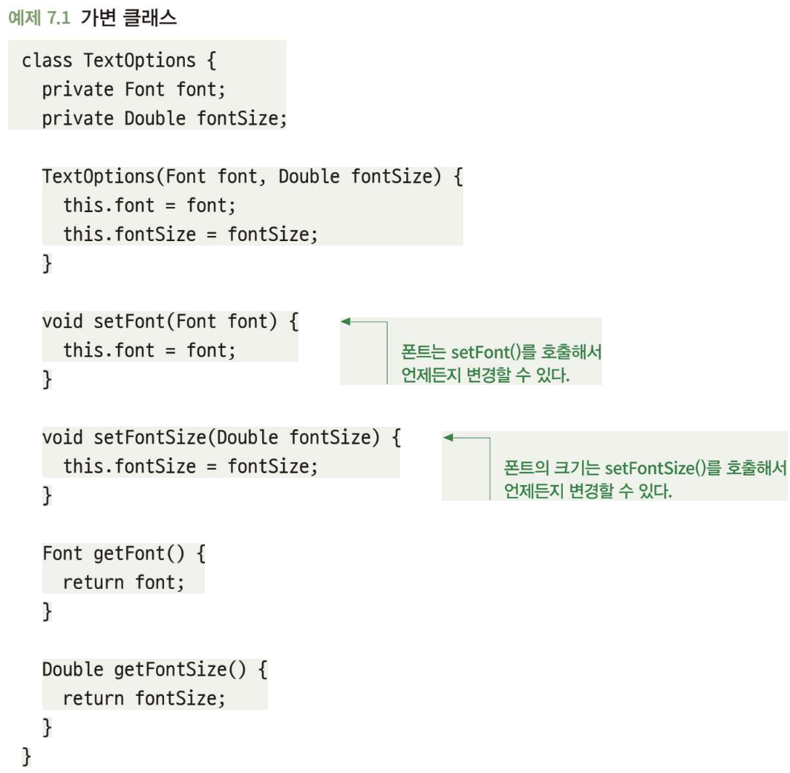

## 7.1.2 해결책: 객체를 생성할 때만 값을 할당하라

> 모든 값이 객체의 생성 시에 제공되고 그 이후로는 변경할 수 없도록 함으로써 클래스를 불변적으로 만들 수 있고 오용도 방지할 수 있다.
>
- `const`, `final`, `readonly`같은 키워드를 사용해 클래스 내에서 변수를 정의할 때, 변수의 값이 변경되지 않도록 할 수 있음
    - 객체의 값을 불가피하게 변경을 해야한다면, copy-on-write(쓰기 시 복사)패턴을 사용하면 좋음

  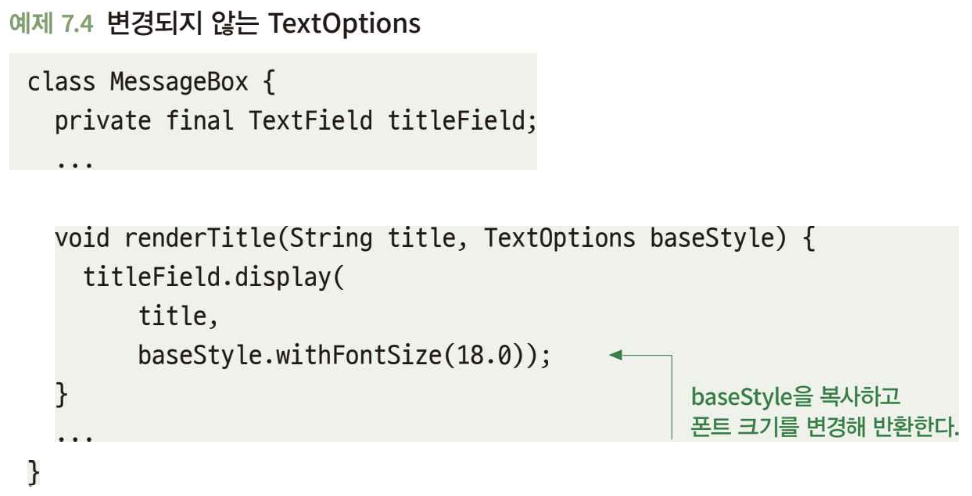

    - 위의 패턴은 모든 객체의 값이 필요해, 바람직한 패턴은 아님

## 7.1.3 해결책: 불변성에 대한 디자인 패턴을 사용하라

> 일부 값이 반드시 필요하지 않거나 불변적인 클래스의 가변적 버전을 만들어야 하는 경우, 클래스를 보다 다용도로 구현해야 할 필요가 있다.
>

### 빌더 패턴

- 객체의 값의 일부가 선택 사할일 때 불변 객체를 만드는 매우 유용한 방법
- 한 클래스를 두 개로 나누는 효과를 가짐
    - 값을 하나씩 설정할 수 있는 빌더 클래스
    - 빌더에 의해 작성된 불변적인 읽기 전용 클래스

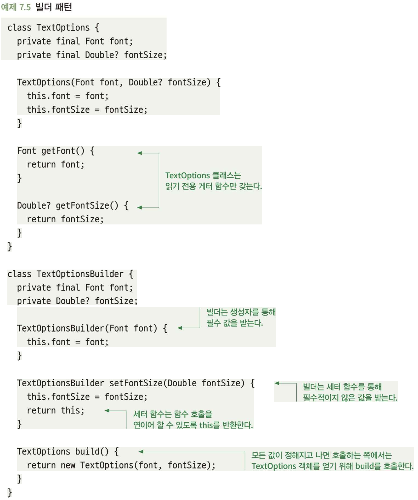

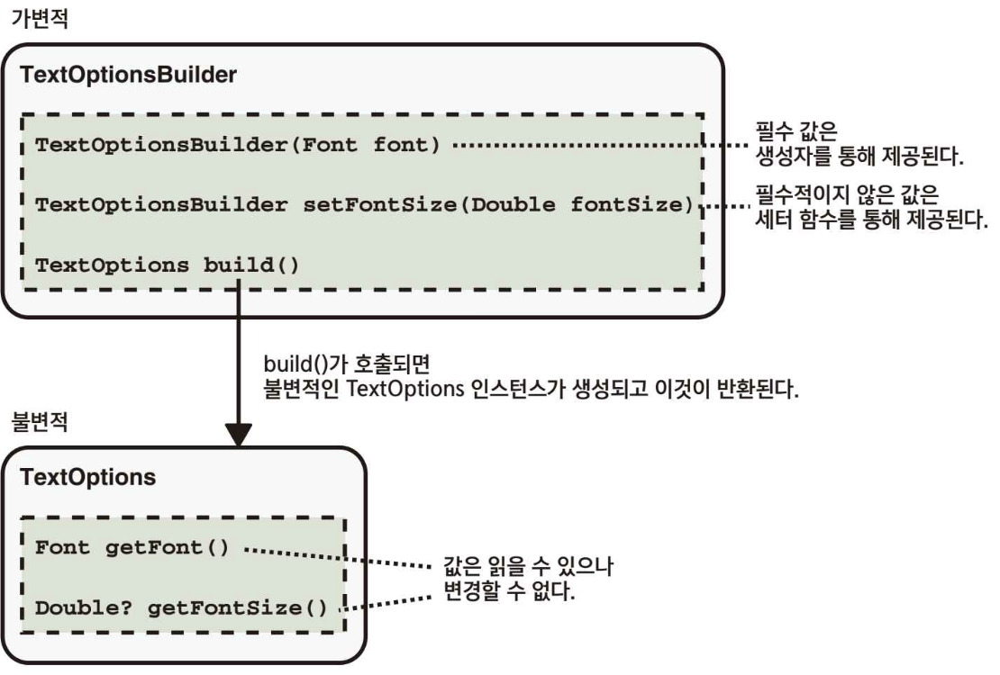

- 빌더 패턴을 구현할 때, 사용하는 특정 기법
    - 더 나은 네임스페이스를 위한 내부 클래스 사용
    - `toBuilder()`를 통해 클래스에서 미리 채워진 빌더를 만들 수 있도록 클래스와 클래스 빌더 사이에 순환 의존성 생성
    - 클래스 생성자를 비공개로 만들어 호출하는 쪽에서 빌더를 사용할 수 밖에 없도록 함
    - 빌더의 인스턴스를 생성자의 인수로 사용하여 반복적으로 사용되는 코드 감소
    - https://github.com/google/auto/blob/main/value/userguide/builders.md를 사용해 클래스 및 빌더 정의를 자동으로 생성할 수 있음

### 쓰기 시 복사(copy-on-write) 패턴

- 불변 객체의 인스턴스를 변경해야 하는 경우에 사용하는 패턴

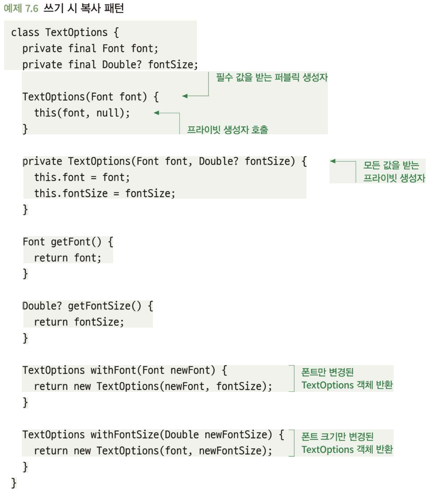

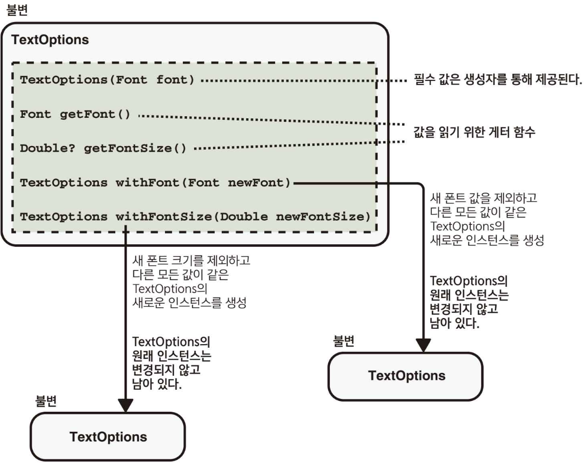

---

- 클래스를 변경할 수 없게 하는 것: 클래스가 오용될 가능성을 최소화하는 좋은 방법
    - 세터 함수를 제거
    - 인스턴스를 생성할 때에만 값을 제공
    - 상황에 맞는 적절한 설계 패턴 사용

# 7.2 객체를 깊은 수준까지 불변적으로 만드는 것을 고려하라

- 깊은 가변성: 클래스가 실수로 가변적으로 될 수 있는 일반적인 원인
    - 멤버 변수 자체가 가변적인 유형
    - 다른 코드가 멤버 변수에 접근할 수 있는 경우

## 7.2.1 깊은 가변성을 오용을 초래할 수 있다

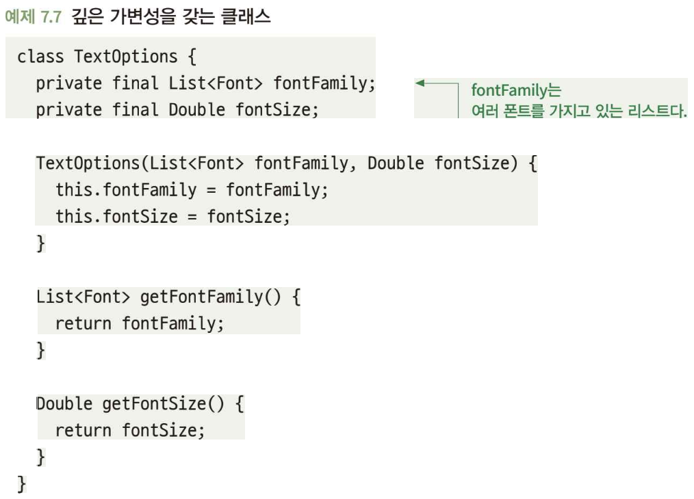

- 위의 클래스는 클래스가 글골 리스트를 완전히 제어할 수 없기 때문에 무의식중에 클래스가 가변적이 될 수 있음
    - `TextOptions` 클래스는 글꼴 목록을 가지고 있는 것이 아니라 참조를 가지고 있기 때문에, 다른 코드에서 글꼴 목록이 변경되면 해당 클래스에도 영향을 미침
        - 글꼴 목록을 직접 변경하는 경우
        - `TextOptions`에서 `getter`로 글꼴 목록을 가져와 변경하는 경우

  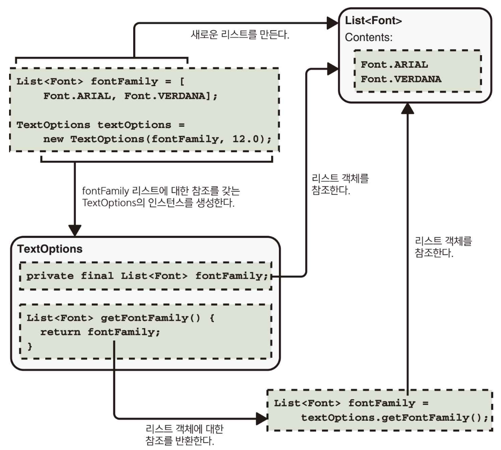

## 7.2.2 해결책: 방어적으로 복사하라

> 클래스가 참조하는 객체가 클래스 외부의 코드에서는 참조할 수 없도록 하면 이 문제를 방지할 수 있다.
>
- 클래스가 생성될 때 그리고 `getter()`를 통해 객체가 반환될 때 객체의 복사본을 만들면 가능함
    - 최선의 해결책은 아니지만, 깊은 불변성을 담보하기 위해 효과가 있는 간단한 방법

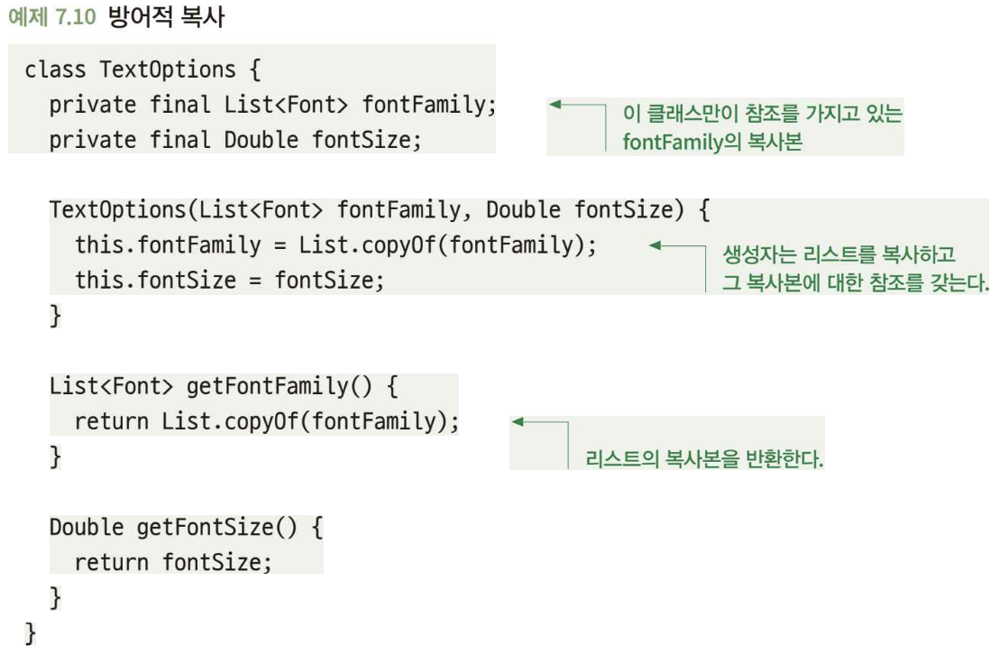

### 방어적으로 복사하면 생기는 단점

- 복사하는 데 비용이 많이 들 수 있다.
    - 복사본을 만드는 데 추가적인 비용이 들기 때문
    - 해당 로직을 광범위하게 사용하는 상황을 생각해보자
- 클래스 내부에서 발생하는 변경을 막아주지 못하는 경우가 많다.
    - 자바에서는 `final`은 변수의 값에 대한 불변성을 의미하고, 변수가 참조하는 객체에 대한 불변성을 의미하지 않기 때문

## 7.2.3 해결책: 불변적 자료구조를 사용하라

> 불변 자료구조를 사용하면, 코드의 어디선가 동일한 리스트에 대한 참조가 있는지는 중요하지 않고 어떤 것도 방어적으로 복사할 필요가 없다.
>
- 불변적인 자료구조를 사용하는 것은 클래스가 깊은 불변성을 갖도록 보장하기 위한 좋은 방법 중 하나
- 방어적으로 복사해야 하는 단점을 피하고 실수로라도 클래스 내의 코드에서 변경되지 않도록 보장함

### 언어에 따른 리스트 불변 자료구조

- 아래의 라이브러리들은 집합이나 맵 그 외 여러 가자 자료구조의 불변적 타입을 가지고 있기 때문에 표준 데이터 타입에 대한 불변적 버전을 찾아볼 수 있음
- JAVA: Guava 라이브러리의 `ImmutableList`
- C#: `System.Collections.Immutable`의 `ImmutableList`
- JS 기반 언어
    - `Immutable.js` 모듈의 `List`
    - Immer 모듈을 사용해 불변적으로 만들어진 JS 배열

# 7.3 지나치게 일반적인 데이터 유형을 피하라

- 일반적이고, 다재자능한 자료구조: 정수, 문자열, 리스트 같은 간단한 데이터 유형
    - 이들은 데이터 유형 자체만으로는 무언가를 설명할 수 없고, 가질 수 있는 값에 있어서도 꽤 관대함
    - 설명이 부족하고 허용하는 범위가 넓을수록 코드 오용은 쉬워짐

## 7.3.1 지나치게 일반적인 유형은 오용될 수 있다

### 일반적인 데이터 유형을 사용하면 생기는 단점

> 코드 계약의 세부 조항에 대한 자세한 지식없이 일반적인 데이터 유형을 사용한 함수를 올바르게 호출하는 것은 거의 불가능하다.
>
- 일반적인 데이터 유형은 아무것도 설명해주지 않음
    - 개발자가 해당 데이터 유형을 사용하는 함수에 대한 문서를 읽어보지 않는다면, 이 데이터가 무엇인지, 어떻게 해야하는지 알지 못할 것
- 혼동하기 쉬움
    - 문서를 완전히 읽지 않았거나 잘못 이해했다면, 오용할 수 있고, 이로 인해 버그가 발생할 것
- 형식 안전성이 거의 없음
    - 컴파일러가 목록 내에 몇 개의 요소가 있는지 보장할 수 없음
        - 내부 리스트에 들어 있는 항목의 수가 잘못될 수 있지만, 컴파일러는 이는 모르기 때문에 정상적으로 컴파일이 됨
        - 런타임에서 해당 문제 대한 오류가 발생함

### 패러다임은 퍼지기 쉽다

- 일반적인 데이터 유형을 사용하는 것은 임시변통의 방법
    - 하나의 함수에만 사용되서 정당화할 수 있지만, 임시변통으로 작성된 코드는 다른 코드 전반에 퍼지는 경향이 있는 문제가 있음
        - 다른 개발자들도 같은 방식으로 하지 않고는 이미 작성된 코드와 상호작용하기 어려워지기 때문
        - 따라서 일반적인 데이터 유형을 사용하면 그 패러다임은 빠르고 광범위하게 퍼짐

## 7.3.2 페어 유형은 오용하기 쉽다

- 많은 프로그래밍 언어에는 페어 데이터 유형이 있음
    - 표준 라이브러리의 일부일 때도 있고, 확장 라이브러리를 통해 제공되는 경우도 있음
- 페어 데이터 유형의 요점: 다른 두 종류의 값을 두 개 저장
    - 데이터의 개수가 맞지 않는 문제는 해결 가능
    - 데이터의 순서를 오용하는 문제는 해결 불가

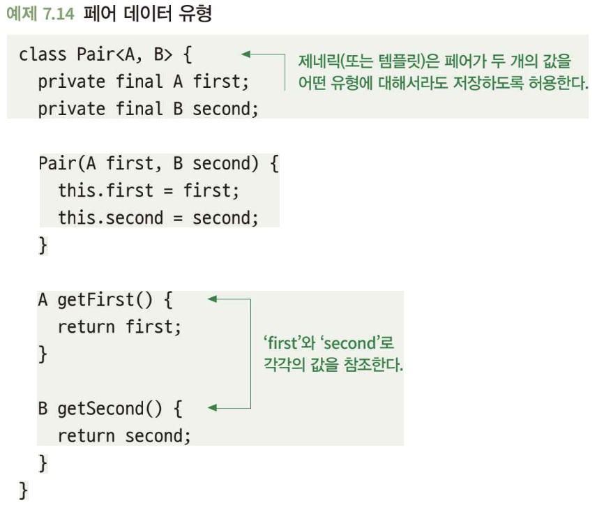

- 페어 데이터 유형도 입력 매개변수를 설명하려면 상당히 복잡한 문서가 필요함
    - 입력 매개변수 유형이 무엇을 의미하는지 파악하기가 쉽지 않음

## 7.3.3 해결책: 전용 유형 사용

> 무언가를 나타내기 위해 새로운 클래스를 정의하는 것은 많은 노력이 들거나 불필요한 것 처럼 보일 수 있지만, 대부분 보기보다 노력이 덜 들어가고 다른 개발자가 코드를 읽을 때 이해하기 쉽고 버그의 가능성도 줄여준다.
>
- 함수의 의미가 자명하기 때문에 복잡한 입력 매개변수를 설명하기 위한 문서가 필요하지 않음
- 유형 안전성이 높아졌고 혼동할 일이 없음
- 코드가 더 명학해지고 오용하기 어렵기 때문에 중장기적으로 보면 시간이 절약됨

# 7.4 시간 처리

## 시간을 나태나는 것이 상당히 까다로운 이유

- 절대적인 시간과 상대적인 시간으로 표현하는 경우가 나뉨
- 시간의 양을 언급하는 경우 다양한 단위 중 하나로 표시해야 함
- 표준 시간대, 일광 절약 시간, 윤년, 윤초와 같은 개념이 있음

## 7.4.1 정수로 시간을 나타내는 것은 문제가 될 수 있다

- 시간을 나타낼 때 일반적으로 `int`나 `long`을 사용해 어느 한 순간을 의미하는 시각과 시간의 양을 나타냄
    - 순간으로서의 시간은 유닉스 시간 이후 몇 초로 표현하는 경우가 많음
        - 윤초는 무시
    - 양으로서의 시간은 초 혹은 ms 단위로 표시할 때가 많음
- 정수는 매우 일반적인 유형이기 때문에 시간을 나타내는 데 사용하는 경우 코드가 오용되기 쉬움

### 한순간의 시간인가, 아니면 시간의 양인가?

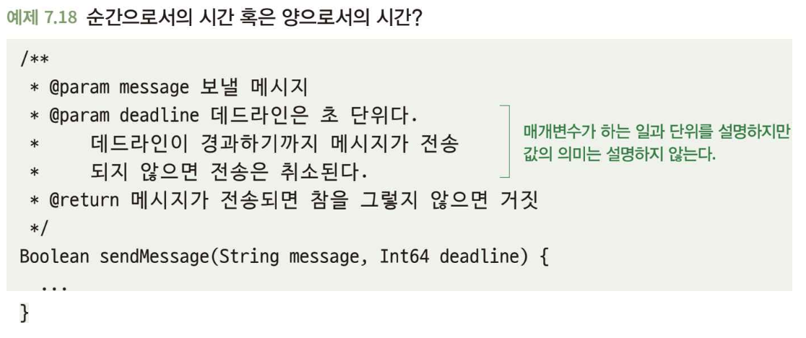

- `deadline`이 하는 일과 단위가 초라는 것이 주석문에 나와 있지만, 이 값이 실제로 무엇을 나타내는지에 대한 설명은 없음
    - 함수로 호출할 때 `deadline`의 인수로 무엇을 제공해야 하는지 명확하지 않음
    - 주석문을 개선하면 모호함이 줄어들고 좀 더 명확해지겠지만, 코드 계약의 세부 조항에 더 많은 내용이 추가될 것임
        - 세부 조항은 코드의 오용을 방지하기 위한 방법으로는 신뢰하기 어려움

### 일치하지 않는 단위

- 시간을 측정하는 데 사용하는 단위는 다름
    - ms, 초, 마이크로초 등 다양한 단위를 사용함
- 정수 유형은 값이 어떤 단위에 있는지 나타내는 데 전혀 도움이 되지 않음

### 시간대 처리 오류

- 날짜와 순간의 차이는 미묘한 것일 수 있지만, 이 두 가지를 다른 방식으로 다루지 않는다면 문제가 될 수 있음

- 서버가 서로 다른 위치에서 실행되고 시스템을 다른 표준 시간대로 설정할 경우 위와 유사한 문제가 서버단의 논리만으로도 발생할 수 있음
- 순간으로서의 시간, 양의로서의 시간, 날짜와 같은 시간에 기초한 개념은 최상의 경우라고 할지라도 사용하기에 까다로움
    - 정수와 같은 매우 일반적인 유형을 사용해 그러한 것들을 표현하라고 한다면 자신뿐만 아니라 다른 개발자까지도 어렵게 만드는 것
        - 정수는 값이 의미하는 바나 나태내고자 하는 정보를 거의 전달하지 못하기 때문

## 7.4.2 해결책: 적절한 자료구조를 사용하라

### 시간을 처리하기 위한 라이브러리

- 아래의 라이브러리를 사용하면 앞서 말한 문제를 쉽게 처리할 수 있음
- JAVA: `java.time`
- C#: Noda 시간 라이브러리
- C++: chrono 라이브러리
- JS: js-joda 라이브러리

### 양으로서의 시간과 순간으로서의 시간을 구분

> 라이브러리가 제공하는 `Instant`라는 클래스와 `Duration`이라는 클래스를 사용하면 함수 매개변수의 유형이 나타내는 것이 순간인지, 시간의 양인지 알 수 있다.
>

### 더 이상 단위에 대한 혼동이 없다

- `Instant`와 `Duration`은 단위가 유형 내에 캡슐화되어 있음
    - 어떤 단위가 사용되어야 하는지 설명하기 위한 계약의 세부 조항이 필요하지 않음
    - 실수로 잘못된 단위를 제공하는 것이 불가능

### 시간대 처리 개선

> `java.time`, 노다 타임 및 js-joda 라이브러리는 모두 `LocalDateTime` 이라는 클래스를 통해 시간대 처리를 정확하게 수행할 수 있다.
>

# 7.5 데이터에 대해 진실의 원천을 하나만 가져야 한다

- 코드에서 데이터는 종종 두 가지의 형태로 제공됨
    - 기본 데이터(primary data): 코드에 제공해야 할 데이터
        - 코드에 이 데이터를 알려주지 않고는 코드가 처리할 방법이 없음
        - 일반적으로 프로그램에서 진실의 원천이 됨
    - 파생 데이터(derived data): 주어진 기본 데이터에 기반해서 코드가 계산할 수 있는 데이터

## 7.5.1 또 다른 진실의 원천은 유효하지 않은 상태를 초래할 수 있다

- 기본 데이터와 파생 데이터를 모두 처리하는 코드를 작성할 때, 논리적으로 잘못된 상태가 발생할 수 있음
    - 이러한 코드를 작성하면 코드의 오용이 너무 쉬워짐
- ex) 계좌 잔액

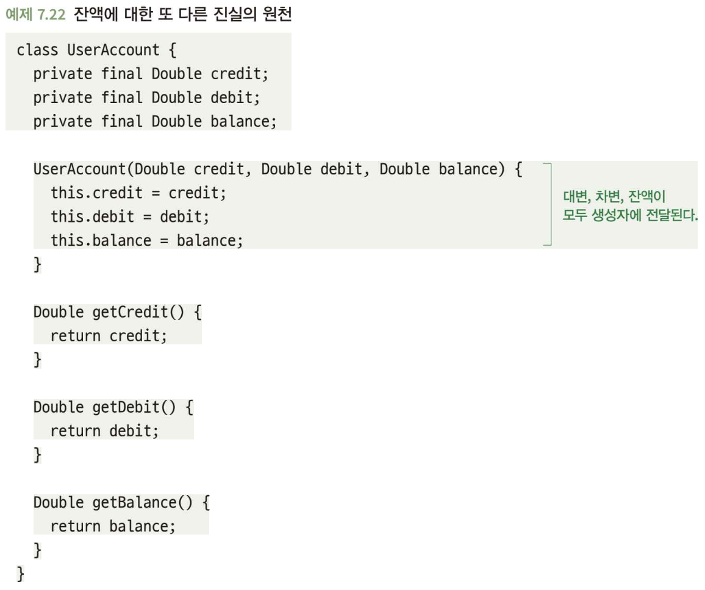

- `UserAccount` 클래스는 대변, 차변 및 계좌 잔액 값으로 구성되어 있음
    - 계좌 잔액은 대변과 차변에서 파생될 수 있기 때문에 중복 정보
    - 중복 정보로 인해 논리적으로 잘못된 상태로 인스턴스를 생성할 수 있음

## 7.5.2 해결책: 기본 데이터를 유일한 진실의 원천으로 사용하라

- 계좌 잔고는 대변과 차변만 가지고 완전히 계산할 수 있기 때문에 필요할 때만 그 값을 계산하는 것이 훨씬 더 나음

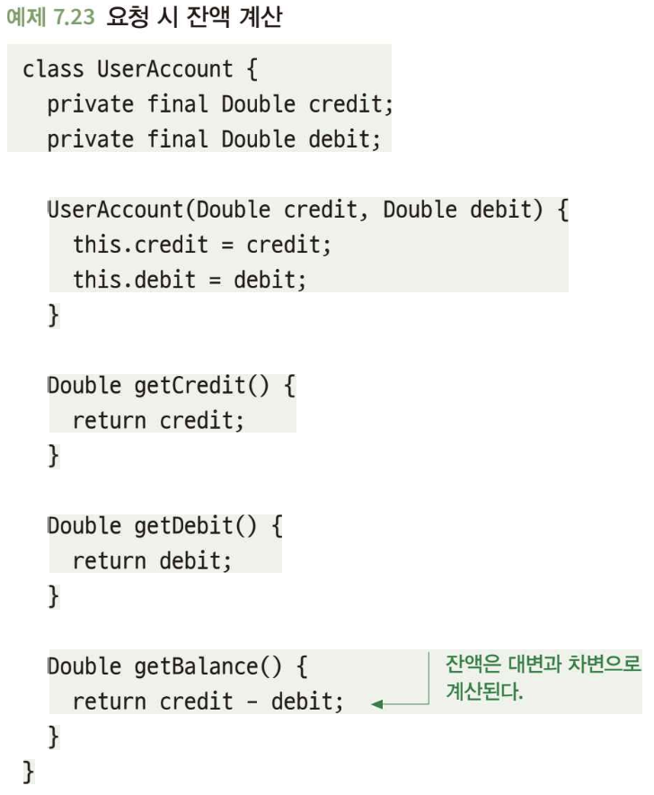

### 데이터 계산에 비용이 많이 드는 경우

- 대변과 차변에 대한 하나의 값이아니라 트랜잭션 목록을 가지고 있다고 가정
    - 이럴경우 파생된 데이터를 계산하려면 전체 트랙잭션 목록을 확인해야하기 때문에 비용이 많이 드는 일
- 파생된 값을 계산하는 데 많은 비용이 든다면 지연(lazily) 계산한 후에 결과를 캐싱하는 것이 좋음
    - 지연 계산: 계산된 값이 정말로 필요할 때까지 계산을 미룸
    - 캐싱된 값이 중복 정보라고 생각할 수 있지만, `UserAccount` 클래스에 완전히 포함되어 있고, 클래스 및 트랜잭션 목록은 모두 불변적이기 때문에 괜찮음
        - `cachedCredit` 및 `cachedDebit`가 트랜잭션 목록과 일치하며 절대 변경되지 않음

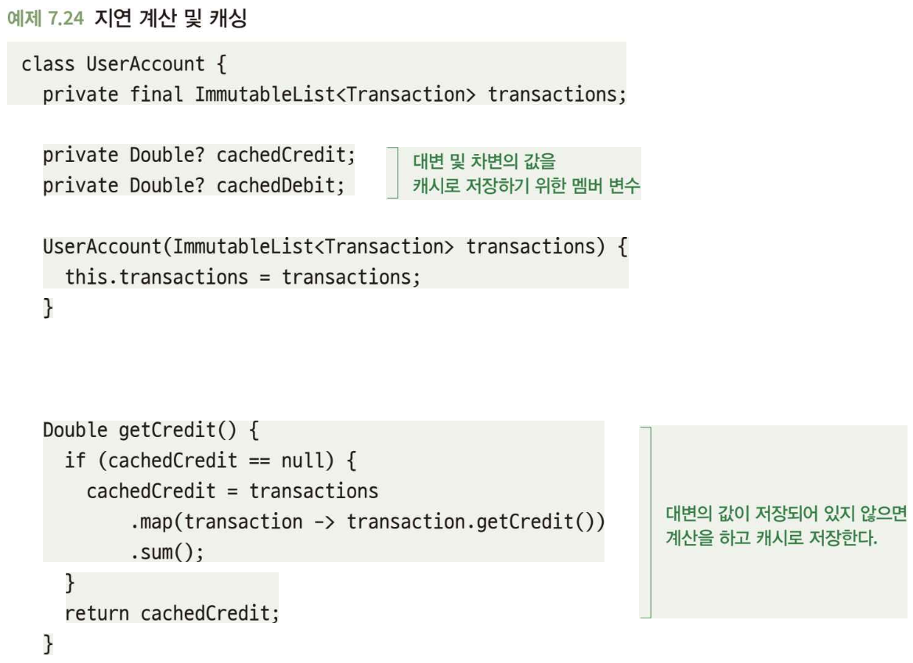
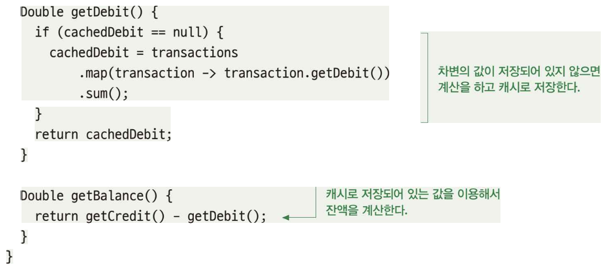

- 클래스가 가변적이라면 상황은 훨씬 복잡해짐
    - 클래스가 변경될 때 마다 캐싱된 값을 `null`로 재설정해야 함
        - 이것은 매우 번거롭고 오류를 일으키기 쉬움
    - 객체를 불변적으로 만들어야 하는 이유 중 하나

# 7.6 논리에 대한 진실의 원천을 하나만 가져야 한다

> 진실의 원천은 코드에 제공된 데이터에만 적용되는 것이 아니라 코드에 포함된 논리에도 적용된다.
>
- 코드의 한 부분에서 수행되는 일이 다른 부분에서 수행되는 일과 일치해야 하는 경우가 많음
    - 일치하지 않으면 SW가 제대로 작동하지 않음
- 논리를 위한 진실의 원천 또한 단 하나만 존재하도록 하는 것이 중요함

## 7.6.1 논리에 대한 진실의 원천이 여러개 있으면 버그를 유발할 수 있다

> 논리에 대한 진실의 원천이 두 개가 있는 상태에서, 클래스가 모두 동일한 논리를 포함하면 모든 것이 잘 작동하지만, 한 클래스가 수정되고 다른 클래스가 수정되지 않으면 문제가 발생한다.
>

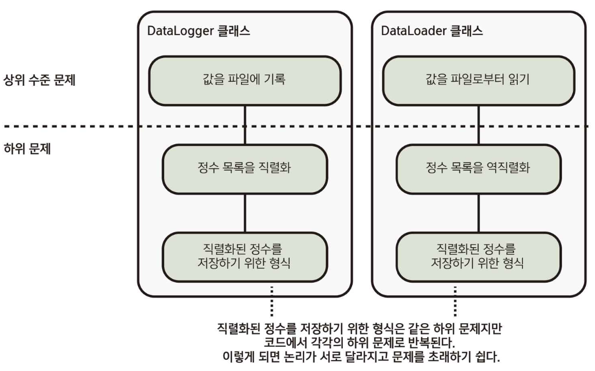

- 논리에 대한 진실의 원천이 두 개가 있는 상태에서 개발자가 하나만 수정하고 다른 하나를 수정하지 않으면 문제가 발생하기 쉬움

## 7.6.2 해결책: 진실의 원천은 단 하나만 있어야 한다

- 앞의 상황에서 직렬화된 정수를 저장하는 형식에 대한 진실의 원천을 하나만 갖게 되면 코드가 더 견고해지고 오류의 가능성을 줄일 수 있음
    - 정수 목록의 직렬화와 역직렬화를 재사용이 가능한 하나의 코드 계층으로 구현하면 단 하나만의 진실의 원천을 가질 수 있음

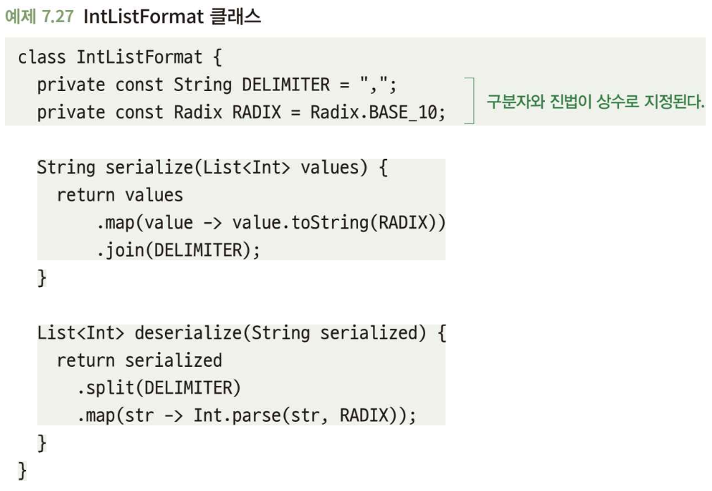

- 위의 `IntListFormat` 클래스와 같이 직렬화된 정수를 저장하는 형식과 관련된 모든 논리를 하나에 구현하면 앞서 제기한 문제를 해결할 수 있음

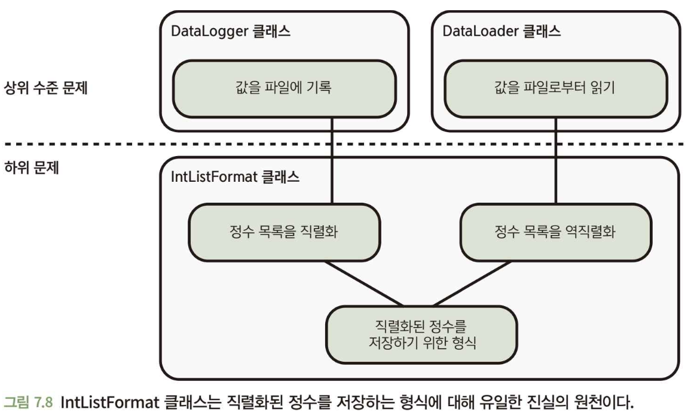

# 요약

- 코드가 오용되기 쉽게 작성되고 나면 어느 시점에선가는 오용될 가능성이 크고 이것은 버그로 이어질 수 있음
- 코드가 오용되는 몇 가지 일반적인 사례
    - 호출하는 족에서 잘못된 입력을 제공
    - 다른 코드에서 일어나는 부수 효과
    - 함수 호출 시점이 잘못되거나 올바른 순서로 호출되지 않은 경우
    - 원래의 코드에 연관된 코드를 수정할 때 원래의 코드가 내포한 가정과 어긋나게 수정하는 경우
- 오용이 어렵거나 불가능하도록 코드를 설계하고 구조화하는 것이 종종 가능함
    - 버그 발생 가능성이 크게 줄어들고 중장기적으로 개발자의 시간을 많이 절약할 수 있음
